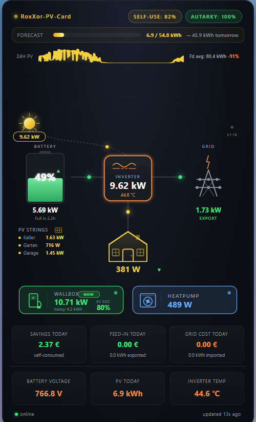

# RoxXor-PV-Card-mre

This is a Fork of RoxXorPro's awesome "roxxor-pv-card" for Home Assistant. The labels have been translated to german and the "heatpump" label has been changed to "3D Drucker" to fit my own needs. See the original repo for reference: [RoxXorPro/roxxor-pv-card](https://github.com/RoxXorPro/roxxor-pv-card/

--------- Original Readme File ---------

[](https://github.com/hacs/integration)
[](https://github.com/RoxXorPro/roxxor-pv-card/releases)
[](LICENSE)

A modern, comprehensive energy flow visualization card for Home Assistant. Designed for PV installations with battery storage, supports multiple inverters (MPPT strings), wallbox/EV charging, and heat pumps.


## Features

- **Live energy flow** between PV, battery, grid, and house with animated direction indicators
- **Animated sun** that travels across an arc based on actual sun position (azimuth/elevation)
- **Curved sun-to-inverter flow line** with animated power dot, speed scales with PV output
- **Self-use & autarky badges** in the header
- **Three PV strings** with individual live readings and active-indicator dots
- **Battery visualization** with SOC color coding (green/orange/red), fill animation, ETA to full/empty, and trend arrow
- **Modern SVG icons** for inverter, grid pylon, house, wallbox, and heat pump (with rotating fan when active)
- **Forecast.Solar integration** with progress bar showing today's actual vs predicted yield, plus tomorrow's forecast
- **24h sparkline** of PV production
- **7-day comparison** showing today's yield vs weekly average
- **Economy bar** with savings, feed-in revenue, and grid cost in your local currency
- **Wallbox details** including charging mode badge (PV/MIN+PV/NOW), today's charged energy, and EV SOC
- **Warning badges** for low battery, hot inverter, or system anomalies
- **Click any element** to open Home Assistant's more-info dialog
- **Sunrise/sunset times** displayed at the sun arc endpoints
- **Health indicator** showing data freshness with automatic stale detection
- **Configurable sign conventions** for grid and battery sensors

## Requirements

- Home Assistant
- One or more PV inverters reporting power to HA
- Battery storage system (optional but recommended)
- Grid power sensor (positive = import, negative = export by default)
- Optional: [Forecast.Solar](https://www.home-assistant.io/integrations/forecast_solar/) integration for predictions
- Optional: [evcc](https://evcc.io/) for wallbox/heat pump integration (the card works without it)

## Installation

### Manual

1. Download `roxxor-pv-card.js` from the [latest release](https://github.com/RoxXorPro/roxxor-pv-card/releases)
2. Copy it to your Home Assistant `/config/www/` folder
3. Add the resource in **Settings → Dashboards → ⋮ → Resources**:
   - URL: `/local/roxxor-pv-card.js`
   - Type: **JavaScript Module**
4. Hard-refresh your browser (`Ctrl+Shift+R`)
5. Add a new card using the manual YAML mode (see configuration below)

### HACS (Custom Repository)

1. Open HACS in Home Assistant
2. Go to **Frontend**
3. Click the three dots in the top right → **Custom repositories**
4. Add:
   - Repository: `https://github.com/RoxXorPro/roxxor-pv-card`
   - Category: `Lovelace`
5. Install the card from the HACS frontend list
6. Hard-refresh your browser

## Configuration

### Minimal example

```yaml
type: custom:roxxor-pv-card
pv1_power: sensor.your_inverter_1_power
pv2_power: sensor.your_inverter_2_power
pv3_power: sensor.your_inverter_3_power
grid_active_power: sensor.your_grid_power
consump: sensor.your_home_consumption
battery_soc: sensor.your_battery_soc
battery_power: sensor.your_battery_power
today_pv: sensor.your_pv_today_energy
```

### Full example

See [`examples/full-example.yaml`](examples/full-example.yaml) for a complete configuration with all available options.

## Configuration options

### Required sensors

| Option | Description |
|---|---|
| `pv1_power`, `pv2_power`, `pv3_power` | PV string power sensors (one per inverter/MPPT) |
| `grid_active_power` | Grid power sensor (bipolar; sign convention configurable) |
| `consump` | House total consumption sensor |
| `battery_soc` | Battery state of charge in % |
| `battery_power` | Battery power sensor (sign convention configurable) |
| `today_pv` | Today's PV energy production in kWh |

### Recommended

| Option | Description | Default |
|---|---|---|
| `pv_total_power` | Fast-updating total PV power sensor (used for sun display and heartbeat) | `sensor.evcc_pv_power` |
| `battery_voltage` | Battery voltage in V | – |
| `inv_temp` | Inverter temperature in °C | – |
| `sun` | Sun entity for position tracking | `sun.sun` |

### Optional - Consumers

| Option | Description |
|---|---|
| `ev_power` | Wallbox/EV charger current power |
| `wallbox_mode` | evcc charging mode sensor (off/pv/minpv/now) |
| `wallbox_energy_today` | Today's wallbox charged energy in kWh |
| `ev_soc` | Connected vehicle's state of charge in % |
| `heatpump_power` | Heat pump current power |

### Optional - Forecast

`forecast_today` and `forecast_tomorrow` accept either a single sensor string or a list of sensors that will be summed automatically (useful for multi-roof installations):

```yaml
forecast_today:
  - sensor.energy_production_today_roof_1
  - sensor.energy_production_today_roof_2
  - sensor.energy_production_today_roof_3
forecast_tomorrow:
  - sensor.energy_production_tomorrow_roof_1
  - sensor.energy_production_tomorrow_roof_2
  - sensor.energy_production_tomorrow_roof_3
```

### Optional - Economics

| Option | Description | Default |
|---|---|---|
| `grid_import_today` | Today's grid import energy in kWh | – |
| `pv_to_grid_today` | Today's grid export energy in kWh | – |
| `electricity_price` | Cost per kWh imported | `0.32` |
| `feed_in_tariff` | Revenue per kWh exported | `0.082` |
| `currency` | Currency symbol displayed | `€` |

### Sign conventions

The card normalizes signs internally. If your direction arrows are inverted, flip these:

| Option | Values | Default | Meaning of default |
|---|---|---|---|
| `grid_positive_means` | `import` / `export` | `import` | Positive grid value = power drawn from grid |
| `battery_positive_means` | `charge` / `discharge` | `discharge` | Positive battery value = battery discharging |

The defaults match the evcc convention.

### Warning thresholds

| Option | Description | Default |
|---|---|---|
| `warn_soc_low` | Battery SOC % below which a warning is shown | `15` |
| `warn_inv_temp_high` | Inverter temperature °C above which a warning is shown | `60` |
| `batt_capacity_wh` | Battery total capacity in Wh (used for ETA calculation) | `15000` |

### Feature toggles

| Option | Default |
|---|---|
| `show_sparkline` | `true` |
| `show_week_compare` | `true` |
| `show_warnings` | `true` |

## How sensor values are interpreted

The card auto-detects unit of measurement from sensor attributes:

- `power` sensors with unit `kW` are converted to watts internally; `W` is used as-is
- `energy` sensors with unit `Wh` are converted to kWh; `kWh` is used as-is
- If your power sensors don't have a `unit_of_measurement` attribute but report kW, set `power_in_kw: true`

## Troubleshooting

### "Custom element doesn't exist: roxxor-pv-card"

- Hard-refresh your browser (`Ctrl+Shift+R`)
- Check the resource URL in **Settings → Dashboards → Resources** — appending `?v=1` (and bumping the number on every update) forces a reload
- Verify the file exists at `/config/www/roxxor-pv-card.js`
- Open browser console (F12) and check for load errors or the `RoxXor-PV-Card v5.x` log line

### Battery/grid direction looks wrong

- Flip `grid_positive_means` (`import` ↔ `export`) and/or `battery_positive_means` (`charge` ↔ `discharge`)

### Status shows "stale"

- Make sure `pv_total_power` points to a fast-updating sensor (every few seconds). The default `sensor.evcc_pv_power` updates in real-time when evcc is running

### Sun position seems off

- Check that your `sun.sun` entity has `azimuth` and `elevation` attributes (standard HA sun integration)
- The sun is hidden when elevation < 0 (night)

### Forecast bar doesn't appear

- The card hides the forecast bar when no forecast sensors return values
- Verify your Forecast.Solar entities exist and have numeric values in kWh

## Screenshots

### Live mode (sun up, battery charging)


### Night mode (sun hidden, battery discharging)


### Wallbox active


## License

MIT - see [LICENSE](LICENSE)

## Contributing

Issues and pull requests welcome. Please include:
- Your sensor configuration (anonymized)
- Browser and Home Assistant versions
- Screenshots if relevant
- Browser console output for errors

## Credits

Built for personal use with a Huawei inverter setup and evcc.io for energy management. Made compatible with any Home Assistant power sensor setup.
